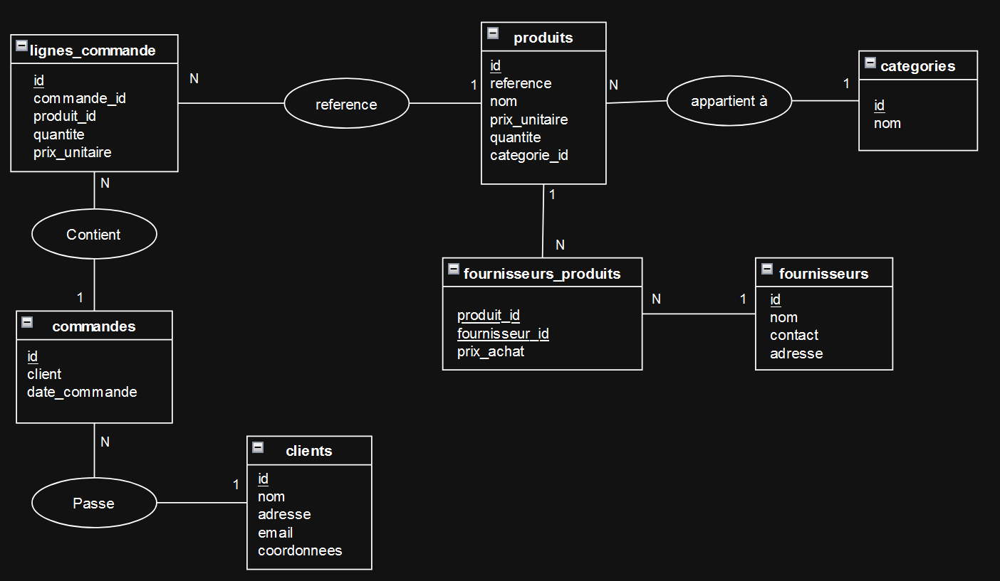

# 2. Livrables - V1

## 2.A Schéma de la base de données / Modèle Conceptuel de Données (MCD)

Avant de pouvoir commencer le développement, j'ai modélisé la base via un MCD.

Dans ce modèle, j’ai mis des données non conformes à la création des tables. C'est à dire qu'une donnée ne doit pas être composée. Par exemple, le nom du client qui devrait être séparé en prénom et nom ou l'adresse qui pourrait être découpée en numéro, rue, code postal et ville.

## 2.B Scripts concernant la base de données

Après avoir fait le MCD, j'ai crée les scripts pour la création des tables (fichier **db.sql**), ainsi que les relations entre les tables et un script pour l’ajout des données (fichier **data.sql**).

## 2.C Développement de l'API

Après la création des tables et l'insertion des données, j'ai entamé le développement de l'API en utilisant Node.js et Express.

L'objectif de cette API est de permettre la gestion des différentes entités du projet via des opérations CRUD (Créer, Lire, Mettre à jour, Supprimer). L’API ne possède pas encore de tests automatisés. Chaque route doit être testée manuellement en utilisant Postman, cURL ou un autre client REST.

## 2.E Développement de la version 2 (V2)

Après avoir effectué l'audit de la V1. Je commence à développer la V2. Dans cette version, il y aura les solutions expliqués dans l'audit.

Voici donc les modifications et les solutions apportées :

- Toutes les informations sensibles liées à la connexion et au lancement du serveur sont retirés du code. Ces informations sont ajoutées dans un fichier `.env`.
-
