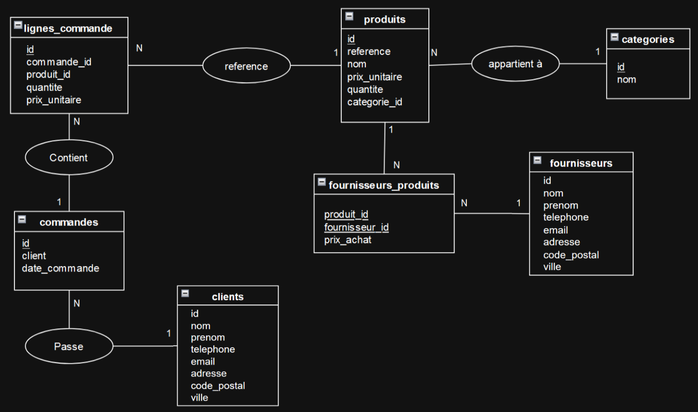

# 2. Livrables - V1

## 2.A Schéma de la base de données / Modèle Conceptuel de Données (MCD)

Avant de pouvoir commencer le développement, j'ai modélisé la base via un MCD.



Dans ce modèle, j’ai mis des données non conformes à la création des tables. C'est à dire qu'une donnée ne doit pas être composée. Par exemple, le nom du client qui devrait être séparé en prénom et nom ou l'adresse qui pourrait être découpée en numéro, rue, code postal et ville.

## 2.B Scripts concernant la base de données

Après avoir fait le MCD, j'ai crée les scripts pour la création des tables (fichier **db.sql**), ainsi que les relations entre les tables et un script pour l’ajout des données (fichier **data.sql**).

## 2.C Développement de l'API

Après la création des tables et l'insertion des données, j'ai entamé le développement de l'API en utilisant Node.js et Express.

L'objectif de cette API est de permettre la gestion des différentes entités du projet via des opérations CRUD (Créer, Lire, Mettre à jour, Supprimer). L’API ne possède pas encore de tests automatisés. Chaque route doit être testée manuellement en utilisant Postman, cURL ou un autre client REST.

## 2.E Développement de la version 2 (V2)

Après avoir effectué l'audit de la V1. Je commence à développer la V2. Dans cette version, il y aura les solutions expliqués dans l'audit.

## 2.F Livrable final

### Présentation des tables

Entités (Tables)

    categories
        id (INT, AUTO_INCREMENT, PRIMARY KEY) : Identifiant unique de la catégorie.
        nom (VARCHAR(50), NOT NULL, UNIQUE) : Nom de la catégorie de produit.

    produits
        id (INT, AUTO_INCREMENT, PRIMARY KEY) : Identifiant unique du produit.
        reference (VARCHAR(50), NOT NULL, UNIQUE) : Référence unique du produit.
        nom (VARCHAR(100), NOT NULL) : Nom du produit.
        prix_unitaire (DECIMAL(10,2), NOT NULL) : Prix unitaire du produit.
        quantite (INT, NOT NULL, DEFAULT 0) : Quantité disponible du produit en stock.
        categorie_id (INT) : Référence à la catégorie du produit, clé étrangère vers categories(id).

    fournisseurs
        id (INT, AUTO_INCREMENT, PRIMARY KEY) : Identifiant unique du fournisseur.
        nom (VARCHAR(50), NOT NULL) : Nom du fournisseur.
        prenom (VARCHAR(50), NOT NULL) : Prénom du fournisseur.
        telephone (VARCHAR(20)) : Numéro de téléphone du fournisseur.
        adresse (VARCHAR(255)) : Adresse du fournisseur.
        code_postal (VARCHAR(20)) : Code postal du fournisseur.
        ville (VARCHAR(100)) : Ville du fournisseur.

    fournisseurs_produits
        produit_id (INT) : Identifiant du produit, clé étrangère vers produits(id).
        fournisseur_id (INT) : Identifiant du fournisseur, clé étrangère vers fournisseurs(id).
        prix_achat (DECIMAL(10,2)) : Prix d'achat du produit chez le fournisseur.

    Relations :
        Une relation many-to-many entre produits et fournisseurs, indiquant les fournisseurs pour chaque produit avec le prix d'achat.

    clients
        id (INT, AUTO_INCREMENT, PRIMARY KEY) : Identifiant unique du client.
        nom (VARCHAR(50), NOT NULL) : Nom du client.
        prenom (VARCHAR(50), NOT NULL) : Prénom du client.
        email (VARCHAR(100), NOT NULL, UNIQUE) : Email du client.
        telephone (VARCHAR(20)) : Numéro de téléphone du client.
        adresse (VARCHAR(255)) : Adresse du client.
        code_postal (VARCHAR(20)) : Code postal du client.
        ville (VARCHAR(100)) : Ville du client.

    commandes
        id (INT, AUTO_INCREMENT, PRIMARY KEY) : Identifiant unique de la commande.
        client_id (INT) : Référence au client ayant passé la commande, clé étrangère vers clients(id).
        date_commande (DATE, NOT NULL) : Date de la commande.

    lignes_commande
        id (INT, AUTO_INCREMENT, PRIMARY KEY) : Identifiant unique de la ligne de commande.
        commande_id (INT) : Référence à la commande, clé étrangère vers commandes(id).
        produit_id (INT) : Référence au produit commandé, clé étrangère vers produits(id).
        quantite (INT, NOT NULL) : Quantité commandée du produit.
        prix_unitaire (DECIMAL(10,2), NOT NULL) : Prix unitaire du produit au moment de la commande.

Relations entre les entités

    categories → produits : Une catégorie peut avoir plusieurs produits (relation un-à-plusieurs).
    produits ←→ fournisseurs : Un produit peut être fourni par plusieurs fournisseurs et un fournisseur peut fournir plusieurs produits (relation plusieurs-à-plusieurs via fournisseurs_produits).
    clients → commandes : Un client peut passer plusieurs commandes (relation un-à-plusieurs).
    commandes → lignes_commande : Une commande peut contenir plusieurs lignes de commande (relation un-à-plusieurs).
    produits → lignes_commande : Un produit peut apparaître dans plusieurs lignes de commande (relation un-à-plusieurs).

### Liste des endpoints de l'API

#### 1. Obtenir la liste des produits

- **Route** : `GET /produits`
- **Paramètres** : Aucun
- **Retour JSON** :
  ```json
  [
    {
      "id": 1,
      "reference": "P001",
      "nom": "Produit 1",
      "prix_unitaire": 12.99,
      "quantite": 100,
      "categorie_id": 1
    },
    {
      "id": 2,
      "reference": "P002",
      "nom": "Produit 2",
      "prix_unitaire": 25.99,
      "quantite": 50,
      "categorie_id": 2
    }
  ]
  ```
- **Exemple d'appel** :
  ```bash
  xh GET http://localhost:3000/produits
  ```

#### 2. Obtenir un produit spécifique

- **Route** : `GET /produits/:id`
- **Paramètres** : `id` (ID du produit à obtenir)
- **Retour JSON** :
  ```json
  {
    "id": 1,
    "reference": "P001",
    "nom": "Produit 1",
    "prix_unitaire": 12.99,
    "quantite": 100,
    "categorie_id": 1
  }
  ```
- **Exemple d'appel** :
  ```bash
  xh GET http://localhost:3000/produits/1
  ```

#### 3. Ajouter un produit

- **Route** : `POST /produits`
- **Paramètres** :
  ```json
  {
    "reference": "P003",
    "nom": "Produit 3",
    "prix_unitaire": 15.5,
    "quantite": 200,
    "categorie_id": 1
  }
  ```
- **Retour JSON** :
  ```json
  {
    "id": 3,
    "reference": "P003",
    "nom": "Produit 3",
    "prix_unitaire": 15.5,
    "quantite": 200,
    "categorie_id": 1
  }
  ```
- **Exemple d'appel** :
  ```bash
  xh POST http://localhost:3000/produits 'Content-Type: application/json' '{"reference": "P003", "nom": "Produit 3", "prix_unitaire": 15.50, "quantite": 200, "categorie_id": 1}'
  ```

#### 4. Mettre à jour un produit

- **Route** : `PUT /produits/:id`
- **Paramètres** :
  ```json
  {
    "prix_unitaire": 18.0,
    "quantite": 150
  }
  ```
- **Retour JSON** :
  ```json
  {
    "id": 1,
    "reference": "P001",
    "nom": "Produit 1",
    "prix_unitaire": 18.0,
    "quantite": 150,
    "categorie_id": 1
  }
  ```
- **Exemple d'appel** :
  ```bash
  xh PUT http://localhost:3000/produits/1 'Content-Type: application/json' '{"prix_unitaire": 18.00, "quantite": 150}'
  ```

### Résumé de l'audit

**Introduction**

L’audit de la version 1 de l’application a révélé plusieurs problèmes liés à la sécurité, à la performance et à la structure du code, impactant la maintenabilité et la qualité générale de l’application. Ce rapport présente les failles identifiées et propose des solutions pour la version 2 (V2).

1. Failles de sécurité

   Injection SQL : L’application est vulnérable à des attaques par injection SQL, dues à la concaténation de données utilisateur dans les requêtes. Solution : Utiliser des requêtes paramétrées ou un ORM comme Sequelize.
   Données sensibles codées en dur : Les identifiants et configurations sont stockés directement dans le code source. Solution : Utiliser des variables d'environnement pour protéger ces données.

2. Problèmes côté serveur (API)

   Absence de validation des entrées : Aucune vérification des données reçues, permettant des erreurs comme des quantités négatives. Solution : Implémenter des validations côté serveur.
   Gestion des erreurs non centralisée : Le système d’erreur n’est pas géré de manière centralisée, ce qui peut exposer des informations sensibles. Solution : Ajouter un middleware de gestion des erreurs.
   Code non commenté et absence de tests automatisés : Le code manque de lisibilité et les tests manuels sont risqués. Solution : Ajouter des commentaires et implémenter des tests automatisés.

3. Problèmes de base de données

   Recréation de la base de données à chaque redémarrage : Cela entraîne la perte des données insérées. Solution : Utiliser un script de migration de base de données.
   Vérifications manquantes sur la cohérence des données : Aucune validation avant l’insertion de données, comme vérifier la disponibilité des produits. Solution : Ajouter des vérifications de cohérence.
   Non-respect des conventions de nommage : Les champs comme le nom du client ne sont pas divisés de manière correcte. Solution : Revoir la structure de la base de données pour respecter les conventions.

4. Problèmes liés à la gestion de projet

   Arborescence du projet linéaire : Le code est difficile à maintenir. Solution : Restructurer le projet pour améliorer l’organisation des fichiers.

Conclusion

L’audit a mis en évidence des failles de sécurité majeures et des problèmes techniques. Les solutions proposées pour la version 2 incluent des requêtes sécurisées, la validation des données, une gestion des erreurs centralisée, ainsi qu’une meilleure organisation du code et des tests automatisés. Ces améliorations garantiront une meilleure sécurité, performance et maintenabilité du projet.
